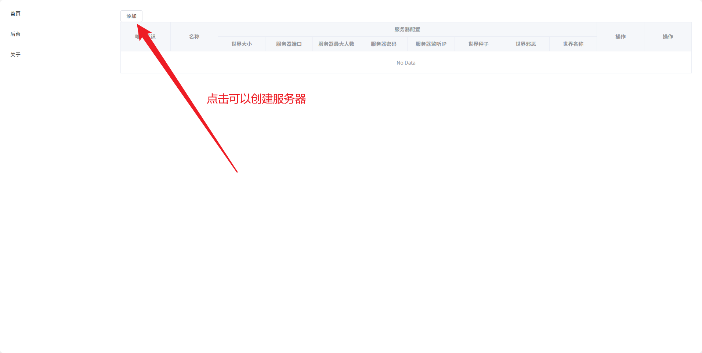
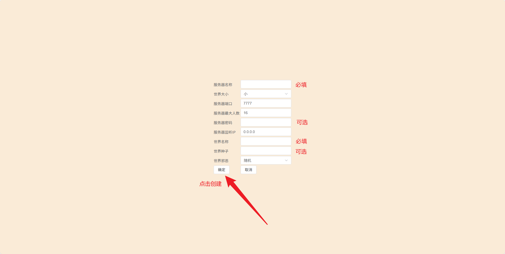
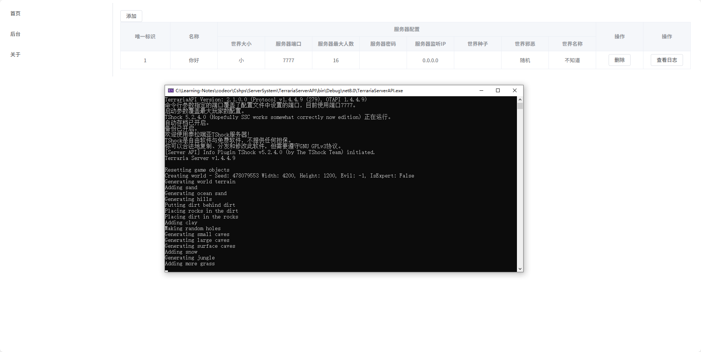

# TerrariaServerManager
泰拉瑞亚服务器管理器

> 使用Tshock进行启动，需要在 TerrariaServerAPI项目中设置 Tshock的路径，在使用前，请先启动一次Tshock自动安装.NET，不用真正开服，到选择世界那里就行。
>
> 在添加服务器时，会自动拷贝所填写的Tshock路径下的Tshock到 TerrariaServerAPI运行目录中，创建的世界位置也在此目录中

